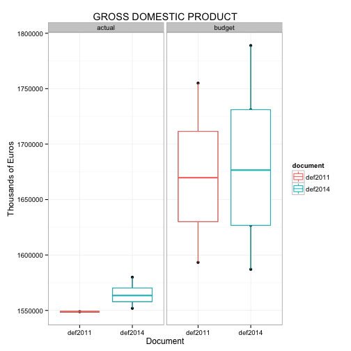
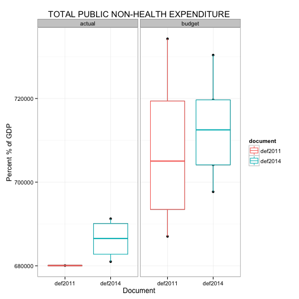
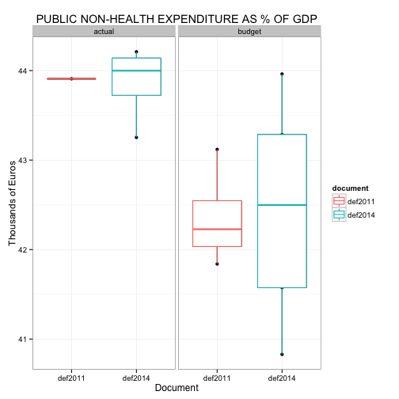
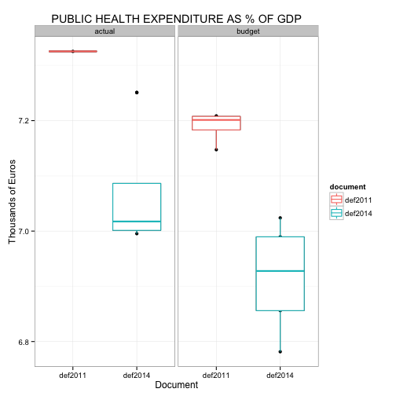

The Crisis of Health Universal Coverage in Italy
========================================================
Stefano Olgiati, Alessandro Danovi
-------------------------------------------------------
**University of Bergamo**


```r
# Reading the raw dataset into R.  The raw data can be downloaded from
# https://github.com/SAO65/DEF_2014/blob/master/data.csv

data <- read.csv("/Users/stefanoolgiati/Desktop/Framework_2/DEF_2014/data.csv")
names(data)
```

```
## [1] "year"        "document"    "status"      "entry"       "description"
## [6] "unit"        "value"
```

```r
head(data, 20)
```

```
##    year document status entry                description   unit   value
## 1  2010  def2011 actual   gdp       GrossDomesticProduct k euro 1548816
## 2  2011  def2011 budget   gdp       GrossDomesticProduct k euro 1593314
## 3  2012  def2011 budget   gdp       GrossDomesticProduct k euro 1642432
## 4  2013  def2011 budget   gdp       GrossDomesticProduct k euro 1696995
## 5  2014  def2011 budget   gdp       GrossDomesticProduct k euro 1755013
## 6  2010  def2011 actual   phe    PublicHealthExpenditure k euro  113457
## 7  2011  def2011 budget   phe    PublicHealthExpenditure k euro  114836
## 8  2012  def2011 budget   phe    PublicHealthExpenditure k euro  117391
## 9  2013  def2011 budget   phe    PublicHealthExpenditure k euro  122102
## 10 2014  def2011 budget   phe    PublicHealthExpenditure k euro  126512
## 11 2010  def2011 actual   tpe     TotalPublicExpenditure k euro  793513
## 12 2011  def2011 budget   tpe     TotalPublicExpenditure k euro  801855
## 13 2012  def2011 budget   tpe     TotalPublicExpenditure k euro  813042
## 14 2013  def2011 budget   tpe     TotalPublicExpenditure k euro  836525
## 15 2014  def2011 budget   tpe     TotalPublicExpenditure k euro  860789
## 16 2010  def2011 actual  pnhe PublicNonHealthExpenditure k euro  680056
## 17 2011  def2011 budget  pnhe PublicNonHealthExpenditure k euro  687019
## 18 2012  def2011 budget  pnhe PublicNonHealthExpenditure k euro  695651
## 19 2013  def2011 budget  pnhe PublicNonHealthExpenditure k euro  714423
## 20 2014  def2011 budget  pnhe PublicNonHealthExpenditure k euro  734277
```

```r

# Synthesize DEF 2011 and DEF 2014
require(plyr)
```

```
## Loading required package: plyr
```

```r

data.summary <- ddply(data, c("document", "entry", "description", "status"), 
    summarise, mean = round(mean(value), 2), median = round(median(value), 2), 
    sd = round(sd(value), 2))
data.summary
```

```
##    document entry                            description status      mean
## 1   def2011   gdp                   GrossDomesticProduct actual 1.549e+06
## 2   def2011   gdp                   GrossDomesticProduct budget 1.672e+06
## 3   def2011     h    PublicHealthExpenditurePerCentOfGDP actual 7.330e+00
## 4   def2011     h    PublicHealthExpenditurePerCentOfGDP budget 7.190e+00
## 5   def2011    nh PublicNonHealthExpenditurePerCentOfGDP actual 4.391e+01
## 6   def2011    nh PublicNonHealthExpenditurePerCentOfGDP budget 4.235e+01
## 7   def2011   phe                PublicHealthExpenditure actual 1.135e+05
## 8   def2011   phe                PublicHealthExpenditure budget 1.202e+05
## 9   def2011  pnhe             PublicNonHealthExpenditure actual 6.801e+05
## 10  def2011  pnhe             PublicNonHealthExpenditure budget 7.078e+05
## 11  def2011     t     TotalPublicExpenditurePerCentOfGDP actual 5.123e+01
## 12  def2011     t     TotalPublicExpenditurePerCentOfGDP budget 4.954e+01
## 13  def2011   tpe                 TotalPublicExpenditure actual 7.935e+05
## 14  def2011   tpe                 TotalPublicExpenditure budget 8.281e+05
## 15  def2014   gdp                   GrossDomesticProduct actual 1.565e+06
## 16  def2014   gdp                   GrossDomesticProduct budget 1.682e+06
## 17  def2014     h    PublicHealthExpenditurePerCentOfGDP actual 7.070e+00
## 18  def2014     h    PublicHealthExpenditurePerCentOfGDP budget 6.920e+00
## 19  def2014    nh PublicNonHealthExpenditurePerCentOfGDP actual 4.387e+01
## 20  def2014    nh PublicNonHealthExpenditurePerCentOfGDP budget 4.243e+01
## 21  def2014   phe                PublicHealthExpenditure actual 1.106e+05
## 22  def2014   phe                PublicHealthExpenditure budget 1.163e+05
## 23  def2014  pnhe          Public Non-Health Expenditure actual 6.863e+05
## 24  def2014  pnhe          Public Non-Health Expenditure budget 7.129e+05
## 25  def2014     t     TotalPublicExpenditurePerCentOfGDP actual 5.094e+01
## 26  def2014     t     TotalPublicExpenditurePerCentOfGDP budget 4.935e+01
## 27  def2014   tpe               Total Public Expenditure actual 7.969e+05
## 28  def2014   tpe               Total Public Expenditure budget 8.291e+05
##       median       sd
## 1  1.549e+06       NA
## 2  1.670e+06 69717.64
## 3  7.330e+00       NA
## 4  7.200e+00     0.03
## 5  4.391e+01       NA
## 6  4.223e+01     0.55
## 7  1.135e+05       NA
## 8  1.197e+05  5167.90
## 9  6.801e+05       NA
## 10 7.050e+05 21010.61
## 11 5.123e+01       NA
## 12 4.940e+01     0.55
## 13 7.935e+05       NA
## 14 8.248e+05 26173.05
## 15 1.563e+06 11879.91
## 16 1.677e+06 80511.19
## 17 7.020e+00     0.12
## 18 6.930e+00     0.10
## 19 4.400e+01     0.43
## 20 4.250e+01     1.26
## 21 1.104e+05  1499.06
## 22 1.161e+05  3901.15
## 23 6.865e+05  4928.99
## 24 7.125e+05 12841.28
## 25 5.112e+01     0.44
## 26 4.943e+01     1.36
## 27 7.967e+05  3527.66
## 28 8.287e+05 16736.61
```

```r
write.csv(file = "data.summary.csv", x = data.summary)


# Plot boxplots of gdp, phe, t, nh and h - both for actual and budget data
# for DEF 2011 and DEF 2014
require(data.table)
```

```
## Loading required package: data.table
```

```r

dt <- data.table(data)
dt
```

```
##     year document status entry                            description
##  1: 2010  def2011 actual   gdp                   GrossDomesticProduct
##  2: 2011  def2011 budget   gdp                   GrossDomesticProduct
##  3: 2012  def2011 budget   gdp                   GrossDomesticProduct
##  4: 2013  def2011 budget   gdp                   GrossDomesticProduct
##  5: 2014  def2011 budget   gdp                   GrossDomesticProduct
##  6: 2010  def2011 actual   phe                PublicHealthExpenditure
##  7: 2011  def2011 budget   phe                PublicHealthExpenditure
##  8: 2012  def2011 budget   phe                PublicHealthExpenditure
##  9: 2013  def2011 budget   phe                PublicHealthExpenditure
## 10: 2014  def2011 budget   phe                PublicHealthExpenditure
## 11: 2010  def2011 actual   tpe                 TotalPublicExpenditure
## 12: 2011  def2011 budget   tpe                 TotalPublicExpenditure
## 13: 2012  def2011 budget   tpe                 TotalPublicExpenditure
## 14: 2013  def2011 budget   tpe                 TotalPublicExpenditure
## 15: 2014  def2011 budget   tpe                 TotalPublicExpenditure
## 16: 2010  def2011 actual  pnhe             PublicNonHealthExpenditure
## 17: 2011  def2011 budget  pnhe             PublicNonHealthExpenditure
## 18: 2012  def2011 budget  pnhe             PublicNonHealthExpenditure
## 19: 2013  def2011 budget  pnhe             PublicNonHealthExpenditure
## 20: 2014  def2011 budget  pnhe             PublicNonHealthExpenditure
## 21: 2010  def2011 actual     t     TotalPublicExpenditurePerCentOfGDP
## 22: 2011  def2011 budget     t     TotalPublicExpenditurePerCentOfGDP
## 23: 2012  def2011 budget     t     TotalPublicExpenditurePerCentOfGDP
## 24: 2013  def2011 budget     t     TotalPublicExpenditurePerCentOfGDP
## 25: 2014  def2011 budget     t     TotalPublicExpenditurePerCentOfGDP
## 26: 2010  def2011 actual    nh PublicNonHealthExpenditurePerCentOfGDP
## 27: 2011  def2011 budget    nh PublicNonHealthExpenditurePerCentOfGDP
## 28: 2012  def2011 budget    nh PublicNonHealthExpenditurePerCentOfGDP
## 29: 2013  def2011 budget    nh PublicNonHealthExpenditurePerCentOfGDP
## 30: 2014  def2011 budget    nh PublicNonHealthExpenditurePerCentOfGDP
## 31: 2010  def2011 actual     h    PublicHealthExpenditurePerCentOfGDP
## 32: 2011  def2011 budget     h    PublicHealthExpenditurePerCentOfGDP
## 33: 2012  def2011 budget     h    PublicHealthExpenditurePerCentOfGDP
## 34: 2013  def2011 budget     h    PublicHealthExpenditurePerCentOfGDP
## 35: 2014  def2011 budget     h    PublicHealthExpenditurePerCentOfGDP
## 36: 2010  def2014 actual   gdp                   GrossDomesticProduct
## 37: 2011  def2014 actual   gdp                   GrossDomesticProduct
## 38: 2012  def2014 actual   gdp                   GrossDomesticProduct
## 39: 2013  def2014 actual   gdp                   GrossDomesticProduct
## 40: 2014  def2014 budget   gdp                   GrossDomesticProduct
## 41: 2015  def2014 budget   gdp                   GrossDomesticProduct
## 42: 2016  def2014 budget   gdp                   GrossDomesticProduct
## 43: 2017  def2014 budget   gdp                   GrossDomesticProduct
## 44: 2018  def2014 budget   gdp                   GrossDomesticProduct
## 45: 2010  def2014 actual   phe                PublicHealthExpenditure
## 46: 2011  def2014 actual   phe                PublicHealthExpenditure
## 47: 2012  def2014 actual   phe                PublicHealthExpenditure
## 48: 2013  def2014 actual   phe                PublicHealthExpenditure
## 49: 2014  def2014 budget   phe                PublicHealthExpenditure
## 50: 2015  def2014 budget   phe                PublicHealthExpenditure
## 51: 2016  def2014 budget   phe                PublicHealthExpenditure
## 52: 2017  def2014 budget   phe                PublicHealthExpenditure
## 53: 2018  def2014 budget   phe                PublicHealthExpenditure
## 54: 2010  def2014 actual     h    PublicHealthExpenditurePerCentOfGDP
## 55: 2011  def2014 actual     h    PublicHealthExpenditurePerCentOfGDP
## 56: 2012  def2014 actual     h    PublicHealthExpenditurePerCentOfGDP
## 57: 2013  def2014 actual     h    PublicHealthExpenditurePerCentOfGDP
## 58: 2014  def2014 budget     h    PublicHealthExpenditurePerCentOfGDP
## 59: 2015  def2014 budget     h    PublicHealthExpenditurePerCentOfGDP
## 60: 2016  def2014 budget     h    PublicHealthExpenditurePerCentOfGDP
## 61: 2017  def2014 budget     h    PublicHealthExpenditurePerCentOfGDP
## 62: 2018  def2014 budget     h    PublicHealthExpenditurePerCentOfGDP
## 63: 2010  def2014 actual   tpe               Total Public Expenditure
## 64: 2011  def2014 actual   tpe               Total Public Expenditure
## 65: 2012  def2014 actual   tpe               Total Public Expenditure
## 66: 2013  def2014 actual   tpe               Total Public Expenditure
## 67: 2014  def2014 budget   tpe               Total Public Expenditure
## 68: 2015  def2014 budget   tpe               Total Public Expenditure
## 69: 2016  def2014 budget   tpe               Total Public Expenditure
## 70: 2017  def2014 budget   tpe               Total Public Expenditure
## 71: 2018  def2014 budget   tpe               Total Public Expenditure
## 72: 2010  def2014 actual  pnhe          Public Non-Health Expenditure
## 73: 2011  def2014 actual  pnhe          Public Non-Health Expenditure
## 74: 2012  def2014 actual  pnhe          Public Non-Health Expenditure
## 75: 2013  def2014 actual  pnhe          Public Non-Health Expenditure
## 76: 2014  def2014 budget  pnhe          Public Non-Health Expenditure
## 77: 2015  def2014 budget  pnhe          Public Non-Health Expenditure
## 78: 2016  def2014 budget  pnhe          Public Non-Health Expenditure
## 79: 2017  def2014 budget  pnhe          Public Non-Health Expenditure
## 80: 2018  def2014 budget  pnhe          Public Non-Health Expenditure
## 81: 2010  def2014 actual     t     TotalPublicExpenditurePerCentOfGDP
## 82: 2011  def2014 actual     t     TotalPublicExpenditurePerCentOfGDP
## 83: 2012  def2014 actual     t     TotalPublicExpenditurePerCentOfGDP
## 84: 2013  def2014 actual     t     TotalPublicExpenditurePerCentOfGDP
## 85: 2014  def2014 budget     t     TotalPublicExpenditurePerCentOfGDP
## 86: 2015  def2014 budget     t     TotalPublicExpenditurePerCentOfGDP
## 87: 2016  def2014 budget     t     TotalPublicExpenditurePerCentOfGDP
## 88: 2017  def2014 budget     t     TotalPublicExpenditurePerCentOfGDP
## 89: 2018  def2014 budget     t     TotalPublicExpenditurePerCentOfGDP
## 90: 2010  def2014 actual    nh PublicNonHealthExpenditurePerCentOfGDP
## 91: 2011  def2014 actual    nh PublicNonHealthExpenditurePerCentOfGDP
## 92: 2012  def2014 actual    nh PublicNonHealthExpenditurePerCentOfGDP
## 93: 2013  def2014 actual    nh PublicNonHealthExpenditurePerCentOfGDP
## 94: 2014  def2014 budget    nh PublicNonHealthExpenditurePerCentOfGDP
## 95: 2015  def2014 budget    nh PublicNonHealthExpenditurePerCentOfGDP
## 96: 2016  def2014 budget    nh PublicNonHealthExpenditurePerCentOfGDP
## 97: 2017  def2014 budget    nh PublicNonHealthExpenditurePerCentOfGDP
## 98: 2018  def2014 budget    nh PublicNonHealthExpenditurePerCentOfGDP
##     year document status entry                            description
##        unit     value
##  1:  k euro 1.549e+06
##  2:  k euro 1.593e+06
##  3:  k euro 1.642e+06
##  4:  k euro 1.697e+06
##  5:  k euro 1.755e+06
##  6:  k euro 1.135e+05
##  7:  k euro 1.148e+05
##  8:  k euro 1.174e+05
##  9:  k euro 1.221e+05
## 10:  k euro 1.265e+05
## 11:  k euro 7.935e+05
## 12:  k euro 8.019e+05
## 13:  k euro 8.130e+05
## 14:  k euro 8.365e+05
## 15:  k euro 8.608e+05
## 16:  k euro 6.801e+05
## 17:  k euro 6.870e+05
## 18:  k euro 6.957e+05
## 19:  k euro 7.144e+05
## 20:  k euro 7.343e+05
## 21: percent 5.123e+01
## 22: percent 5.033e+01
## 23: percent 4.950e+01
## 24: percent 4.929e+01
## 25: percent 4.905e+01
## 26: percent 4.391e+01
## 27: percent 4.312e+01
## 28: percent 4.235e+01
## 29: percent 4.210e+01
## 30: percent 4.184e+01
## 31: percent 7.325e+00
## 32: percent 7.207e+00
## 33: percent 7.147e+00
## 34: percent 7.195e+00
## 35: percent 7.209e+00
## 36:  k euro 1.552e+06
## 37:  k euro 1.580e+06
## 38:  k euro 1.567e+06
## 39:  k euro 1.560e+06
## 40:  k euro 1.587e+06
## 41:  k euro 1.627e+06
## 42:  k euro 1.677e+06
## 43:  k euro 1.731e+06
## 44:  k euro 1.789e+06
## 45:  k euro 1.125e+05
## 46:  k euro 1.111e+05
## 47:  k euro 1.096e+05
## 48:  k euro 1.093e+05
## 49:  k euro 1.115e+05
## 50:  k euro 1.137e+05
## 51:  k euro 1.161e+05
## 52:  k euro 1.187e+05
## 53:  k euro 1.213e+05
## 54: percent 7.251e+00
## 55: percent 7.032e+00
## 56: percent 6.995e+00
## 57: percent 7.003e+00
## 58: percent 7.024e+00
## 59: percent 6.990e+00
## 60: percent 6.928e+00
## 61: percent 6.856e+00
## 62: percent 6.782e+00
## 63:  k euro 7.935e+05
## 64:  k euro 7.945e+05
## 65:  k euro 8.009e+05
## 66:  k euro 7.989e+05
## 67:  k euro 8.092e+05
## 68:  k euro 8.178e+05
## 69:  k euro 8.287e+05
## 70:  k euro 8.383e+05
## 71:  k euro 8.517e+05
## 72:  k euro 6.810e+05
## 73:  k euro 6.834e+05
## 74:  k euro 6.913e+05
## 75:  k euro 6.897e+05
## 76:  k euro 6.977e+05
## 77:  k euro 7.041e+05
## 78:  k euro 7.125e+05
## 79:  k euro 7.197e+05
## 80:  k euro 7.304e+05
## 81: percent 5.113e+01
## 82: percent 5.028e+01
## 83: percent 5.111e+01
## 84: percent 5.121e+01
## 85: percent 5.099e+01
## 86: percent 5.027e+01
## 87: percent 4.943e+01
## 88: percent 4.843e+01
## 89: percent 4.761e+01
## 90: percent 4.388e+01
## 91: percent 4.325e+01
## 92: percent 4.412e+01
## 93: percent 4.421e+01
## 94: percent 4.396e+01
## 95: percent 4.329e+01
## 96: percent 4.250e+01
## 97: percent 4.157e+01
## 98: percent 4.083e+01
##        unit     value
```

```r
tables()
```

```
##      NAME NROW MB COLS                                              KEY
## [1,] dt     98 1  year,document,status,entry,description,unit,value    
## Total: 1MB
```

```r

dt.gdp <- dt[dt$entry == "gdp"]
dt.gdp
```

```
##     year document status entry          description   unit   value
##  1: 2010  def2011 actual   gdp GrossDomesticProduct k euro 1548816
##  2: 2011  def2011 budget   gdp GrossDomesticProduct k euro 1593314
##  3: 2012  def2011 budget   gdp GrossDomesticProduct k euro 1642432
##  4: 2013  def2011 budget   gdp GrossDomesticProduct k euro 1696995
##  5: 2014  def2011 budget   gdp GrossDomesticProduct k euro 1755013
##  6: 2010  def2014 actual   gdp GrossDomesticProduct k euro 1551886
##  7: 2011  def2014 actual   gdp GrossDomesticProduct k euro 1579946
##  8: 2012  def2014 actual   gdp GrossDomesticProduct k euro 1566912
##  9: 2013  def2014 actual   gdp GrossDomesticProduct k euro 1560024
## 10: 2014  def2014 budget   gdp GrossDomesticProduct k euro 1587053
## 11: 2015  def2014 budget   gdp GrossDomesticProduct k euro 1626750
## 12: 2016  def2014 budget   gdp GrossDomesticProduct k euro 1676571
## 13: 2017  def2014 budget   gdp GrossDomesticProduct k euro 1731027
## 14: 2018  def2014 budget   gdp GrossDomesticProduct k euro 1788900
```

```r

dt.phe <- dt[dt$entry == "phe"]
dt.phe
```

```
##     year document status entry             description   unit  value
##  1: 2010  def2011 actual   phe PublicHealthExpenditure k euro 113457
##  2: 2011  def2011 budget   phe PublicHealthExpenditure k euro 114836
##  3: 2012  def2011 budget   phe PublicHealthExpenditure k euro 117391
##  4: 2013  def2011 budget   phe PublicHealthExpenditure k euro 122102
##  5: 2014  def2011 budget   phe PublicHealthExpenditure k euro 126512
##  6: 2010  def2014 actual   phe PublicHealthExpenditure k euro 112526
##  7: 2011  def2014 actual   phe PublicHealthExpenditure k euro 111094
##  8: 2012  def2014 actual   phe PublicHealthExpenditure k euro 109611
##  9: 2013  def2014 actual   phe PublicHealthExpenditure k euro 109254
## 10: 2014  def2014 budget   phe PublicHealthExpenditure k euro 111474
## 11: 2015  def2014 budget   phe PublicHealthExpenditure k euro 113703
## 12: 2016  def2014 budget   phe PublicHealthExpenditure k euro 116149
## 13: 2017  def2014 budget   phe PublicHealthExpenditure k euro 118680
## 14: 2018  def2014 budget   phe PublicHealthExpenditure k euro 121316
```

```r

dt.pnhe <- dt[dt$entry == "pnhe"]
dt.pnhe
```

```
##     year document status entry                   description   unit  value
##  1: 2010  def2011 actual  pnhe    PublicNonHealthExpenditure k euro 680056
##  2: 2011  def2011 budget  pnhe    PublicNonHealthExpenditure k euro 687019
##  3: 2012  def2011 budget  pnhe    PublicNonHealthExpenditure k euro 695651
##  4: 2013  def2011 budget  pnhe    PublicNonHealthExpenditure k euro 714423
##  5: 2014  def2011 budget  pnhe    PublicNonHealthExpenditure k euro 734277
##  6: 2010  def2014 actual  pnhe Public Non-Health Expenditure k euro 680987
##  7: 2011  def2014 actual  pnhe Public Non-Health Expenditure k euro 683372
##  8: 2012  def2014 actual  pnhe Public Non-Health Expenditure k euro 691262
##  9: 2013  def2014 actual  pnhe Public Non-Health Expenditure k euro 689686
## 10: 2014  def2014 budget  pnhe Public Non-Health Expenditure k euro 697698
## 11: 2015  def2014 budget  pnhe Public Non-Health Expenditure k euro 704140
## 12: 2016  def2014 budget  pnhe Public Non-Health Expenditure k euro 712504
## 13: 2017  def2014 budget  pnhe Public Non-Health Expenditure k euro 719668
## 14: 2018  def2014 budget  pnhe Public Non-Health Expenditure k euro 730387
```

```r

dt.nh <- dt[dt$entry == "nh"]
dt.nh
```

```
##     year document status entry                            description
##  1: 2010  def2011 actual    nh PublicNonHealthExpenditurePerCentOfGDP
##  2: 2011  def2011 budget    nh PublicNonHealthExpenditurePerCentOfGDP
##  3: 2012  def2011 budget    nh PublicNonHealthExpenditurePerCentOfGDP
##  4: 2013  def2011 budget    nh PublicNonHealthExpenditurePerCentOfGDP
##  5: 2014  def2011 budget    nh PublicNonHealthExpenditurePerCentOfGDP
##  6: 2010  def2014 actual    nh PublicNonHealthExpenditurePerCentOfGDP
##  7: 2011  def2014 actual    nh PublicNonHealthExpenditurePerCentOfGDP
##  8: 2012  def2014 actual    nh PublicNonHealthExpenditurePerCentOfGDP
##  9: 2013  def2014 actual    nh PublicNonHealthExpenditurePerCentOfGDP
## 10: 2014  def2014 budget    nh PublicNonHealthExpenditurePerCentOfGDP
## 11: 2015  def2014 budget    nh PublicNonHealthExpenditurePerCentOfGDP
## 12: 2016  def2014 budget    nh PublicNonHealthExpenditurePerCentOfGDP
## 13: 2017  def2014 budget    nh PublicNonHealthExpenditurePerCentOfGDP
## 14: 2018  def2014 budget    nh PublicNonHealthExpenditurePerCentOfGDP
##        unit value
##  1: percent 43.91
##  2: percent 43.12
##  3: percent 42.35
##  4: percent 42.10
##  5: percent 41.84
##  6: percent 43.88
##  7: percent 43.25
##  8: percent 44.12
##  9: percent 44.21
## 10: percent 43.96
## 11: percent 43.29
## 12: percent 42.50
## 13: percent 41.57
## 14: percent 40.83
```

```r

dt.h <- dt[dt$entry == "h"]
dt.h
```

```
##     year document status entry                         description    unit
##  1: 2010  def2011 actual     h PublicHealthExpenditurePerCentOfGDP percent
##  2: 2011  def2011 budget     h PublicHealthExpenditurePerCentOfGDP percent
##  3: 2012  def2011 budget     h PublicHealthExpenditurePerCentOfGDP percent
##  4: 2013  def2011 budget     h PublicHealthExpenditurePerCentOfGDP percent
##  5: 2014  def2011 budget     h PublicHealthExpenditurePerCentOfGDP percent
##  6: 2010  def2014 actual     h PublicHealthExpenditurePerCentOfGDP percent
##  7: 2011  def2014 actual     h PublicHealthExpenditurePerCentOfGDP percent
##  8: 2012  def2014 actual     h PublicHealthExpenditurePerCentOfGDP percent
##  9: 2013  def2014 actual     h PublicHealthExpenditurePerCentOfGDP percent
## 10: 2014  def2014 budget     h PublicHealthExpenditurePerCentOfGDP percent
## 11: 2015  def2014 budget     h PublicHealthExpenditurePerCentOfGDP percent
## 12: 2016  def2014 budget     h PublicHealthExpenditurePerCentOfGDP percent
## 13: 2017  def2014 budget     h PublicHealthExpenditurePerCentOfGDP percent
## 14: 2018  def2014 budget     h PublicHealthExpenditurePerCentOfGDP percent
##     value
##  1: 7.325
##  2: 7.207
##  3: 7.147
##  4: 7.195
##  5: 7.209
##  6: 7.251
##  7: 7.032
##  8: 6.995
##  9: 7.003
## 10: 7.024
## 11: 6.990
## 12: 6.928
## 13: 6.856
## 14: 6.782
```

```r

dt$document <- factor(dt$document, labels = c("def2011", "def2014"))
dt$document
```

```
##  [1] def2011 def2011 def2011 def2011 def2011 def2011 def2011 def2011
##  [9] def2011 def2011 def2011 def2011 def2011 def2011 def2011 def2011
## [17] def2011 def2011 def2011 def2011 def2011 def2011 def2011 def2011
## [25] def2011 def2011 def2011 def2011 def2011 def2011 def2011 def2011
## [33] def2011 def2011 def2011 def2014 def2014 def2014 def2014 def2014
## [41] def2014 def2014 def2014 def2014 def2014 def2014 def2014 def2014
## [49] def2014 def2014 def2014 def2014 def2014 def2014 def2014 def2014
## [57] def2014 def2014 def2014 def2014 def2014 def2014 def2014 def2014
## [65] def2014 def2014 def2014 def2014 def2014 def2014 def2014 def2014
## [73] def2014 def2014 def2014 def2014 def2014 def2014 def2014 def2014
## [81] def2014 def2014 def2014 def2014 def2014 def2014 def2014 def2014
## [89] def2014 def2014 def2014 def2014 def2014 def2014 def2014 def2014
## [97] def2014 def2014
## Levels: def2011 def2014
```

```r

dt$status <- factor(dt$status, labels = c("actual", "budget"))
dt$status
```

```
##  [1] actual budget budget budget budget actual budget budget budget budget
## [11] actual budget budget budget budget actual budget budget budget budget
## [21] actual budget budget budget budget actual budget budget budget budget
## [31] actual budget budget budget budget actual actual actual actual budget
## [41] budget budget budget budget actual actual actual actual budget budget
## [51] budget budget budget actual actual actual actual budget budget budget
## [61] budget budget actual actual actual actual budget budget budget budget
## [71] budget actual actual actual actual budget budget budget budget budget
## [81] actual actual actual actual budget budget budget budget budget actual
## [91] actual actual actual budget budget budget budget budget
## Levels: actual budget
```

```r

require(ggplot2)
```

```
## Loading required package: ggplot2
```

```r

qplot(document, value, data = dt.gdp, main = "GROSS DOMESTIC PRODUCT", geom = "boxplot") + 
    xlab("Document") + ylab("Thousands of Euros") + facet_grid(. ~ status, scales = "free") + 
    theme(strip.text.y = element_text()) + geom_point() + theme_bw() + geom_boxplot(data = dt.gdp, 
    mapping = aes(x = document, y = value, color = document))
```

 

```r

qplot(document, value, data = dt.pnhe, main = "TOTAL PUBLIC NON-HEALTH EXPENDITURE", 
    geom = "boxplot") + xlab("Document") + ylab("Percent % of GDP") + facet_grid(. ~ 
    status, scales = "free") + theme(strip.text.y = element_text()) + geom_point() + 
    theme_bw() + geom_boxplot(data = dt.pnhe, mapping = aes(x = document, y = value, 
    color = document))
```

 

```r

qplot(document, value, data = dt.nh, main = "PUBLIC NON-HEALTH EXPENDITURE AS % OF GDP", 
    geom = "boxplot") + xlab("Document") + ylab("Thousands of Euros") + facet_grid(. ~ 
    status, scales = "free") + theme(strip.text.y = element_text()) + geom_point() + 
    theme_bw() + geom_boxplot(data = dt.nh, mapping = aes(x = document, y = value, 
    color = document))
```

 

```r

qplot(document, value, data = dt.h, main = "PUBLIC HEALTH EXPENDITURE AS % OF GDP", 
    geom = "boxplot") + xlab("Document") + ylab("Thousands of Euros") + facet_grid(. ~ 
    status, scales = "free") + theme(strip.text.y = element_text()) + geom_point() + 
    theme_bw() + geom_boxplot(data = dt.h, mapping = aes(x = document, y = value, 
    color = document))
```

 

```r

# Calculate Unpaired Welch Two Sample t-test for difference of h between DEF
# 2011 and DEF 2014
dt.h.def2011 <- dt[dt$entry == "h" & dt$document == "def2011"]
dt.h.def2014 <- dt[dt$entry == "h" & dt$document == "def2014"]
h.def2011 <- as.numeric(dt.h.def2011$value)
h.def2014 <- as.numeric(dt.h.def2014$value)
t.test(h.def2011, h.def2014)
```

```
## 
## 	Welch Two Sample t-test
## 
## data:  h.def2011 and h.def2014
## t = 4.428, df = 11.98, p-value = 0.0008269
## alternative hypothesis: true difference in means is not equal to 0
## 95 percent confidence interval:
##  0.1180 0.3467
## sample estimates:
## mean of x mean of y 
##     7.217     6.984
```

```r

# Calculate Confidence Interval for difference of h between DEF 2011 and DEF
# 2014
probs <- c(0.025, 0.975)
quantile(h.def2011, probs)
```

```
##  2.5% 97.5% 
## 7.152 7.314
```

```r
quantile(h.def2014, probs)
```

```
##  2.5% 97.5% 
## 6.796 7.207
```
